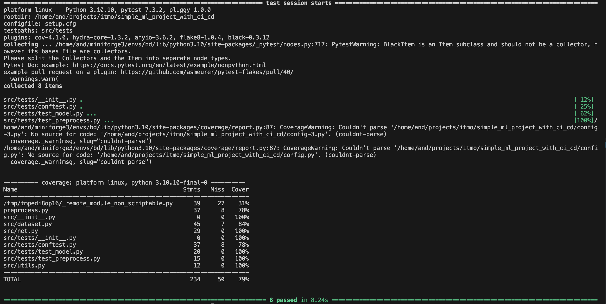

# Simple ML project with CI & CD & DB & Ansible

Dataset: [humpback-whale-identification](https://www.kaggle.com/competitions/humpback-whale-identification)

# Project structure
```
├── .github                           <- Github Actions workflows
├── .dvc                              <- DVC configs
│
├── database                          <- Dir where database scripts are placed
│   └── mongo.py                        <- MongoDB client API
│
├── data                              <- Dir where dataset will be placed
│   ├── download_data.sh                <- Download preprocessed data using dvc
│   ├── download_full_kaggle_data.sh    <- Dowload raw dataset from Kaggle
│   └── preprocess_data.sh              <- Prepare raw dataset and upload it to DVC
│
├── src                               <- Training utils
│   ├── tests/                          <- Testing scripts
│   ├── dataset.py                      <- Dataset class
│   ├── net.py                          <- Neural network class
│   └── utils.py                        <- Other utils
│
├── tests/                            <- Dataset for scripts testing
├── config.yml                        <- Config for training & inference precesses 
├── docker-compose.yml                <- Config to run application with Docker Compose
├── Dockerfile                        <- Docker Image config
├── preprocess.py                     <- Source code for data preprocessing
├── train.py                          <- Source code for training
├── predict.py                        <- Source code for inference
├── requirements.txt                  <- Project requirements
├── setup.cfg                         <- Pytest configuration file
└── README.md                         <- Project documentation
```

# Quick start

## Initialize environment variables
Create **.env** file in project dir. Example: [./.env_example](.env_example)
```bash
sh init_env.sh
```

## Download dataset
### Using dvc
```bash
sh data/download_data.sh
```
### Using Kaggle API
```bash
sh data/download_full_kaggle_data.sh
sh data/preprocess_data.sh
```

## Train model
- Configure training params in [./config.yml](./config.yml)
- Start training
    ```bash
    python train.py
    ```

## Inference
- Configure inference params in [./config.yml](./config.yml)
- Run inference
    ```bash
    python predict.py
    ```
- Prediction will be saved in MongoDB

## Testing 
- Full testing (just run `pytest`)
    ```bash
    pytest
    ```
- Skipping training phase
    ```bash
    pytest --skip-slow
    ```
Also you can run testing using docker compose: 
```bash
docker compose up
```


# Assets
## Pytest local result


## CI & CD configuration 
- [CI Pipeline](https://github.com/traptrip/simple_ml_project_with_secrets/blob/main/.github/workflows/ci.yml)
- [CD Pipeline](https://github.com/traptrip/simple_ml_project_with_secrets/blob/main/.github/workflows/cd.yml)
